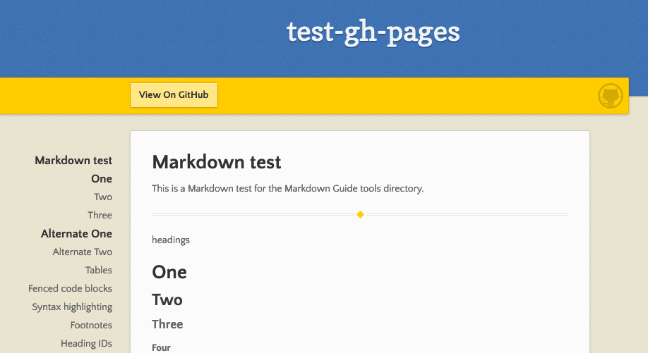

#                               WHAT IS THE GITHUB PAGES AND HOW TO USE IT

GitHub Pages is a static site hosting service that takes HTML, CSS, and JavaScript files straight from a repository on GitHub, optionally runs the files through a build process, and publishes a website. 

learn more abot [github pages](https://docs.github.com/en/github/working-with-github-pages/about-github-pages) .

## What is Markdown or MD? 

is a way to style text on the web. You control the display of the document; formatting words as bold or italic, adding images, and creating lists are just a few of the things we can do with Markdown. Mostly, Markdown is just regular text with a few non-alphabetic characters thrown in .

### Basic writing and formatting syntax using MD 

\
Headings To create a heading, add one to six # symbols before your heading text. The number of # you use will determine the size of the heading.

\# The largest heading

\## The second largest heading

\###### The smallest heading

# The largest heading
## The second largest heading
###### The smallest heading
Rendered H1, H2, and H6 headings

Emphasis

*This text will be italic*

\_This will also be italic_

**This text will be bold**

\__This will also be bold__

_You **can** combine them_

To know more about using markdown and how to use it you can read this [artical](https://docs.github.com/en/github/writing-on-github/basic-writing-and-formatting-syntax) and this [artical](https://guides.github.com/features/mastering-markdown/)