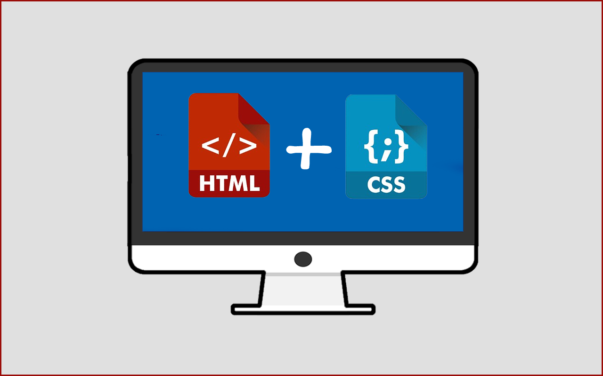

# html-css

### Attributes Tell Us More About El ements

\
\
Attributes provide additional information
about the contents of an element. They appear
on the opening tag of the element and are
made up of two parts: a name and a value,
separated by an equals sign.

* you can creating a Web Page
on a PC using any text editor 

* HTML pages are text documents.

* HTML uses tags (characters that sit inside angled
brackets) to give the information they surround special
meaning.

* Tags are often referred to as elements.

* Tags usually come in pairs. The opening tag denotes
the start of a piece of content; the closing tag denotes the end.

* Opening tags can carry attributes, which tell us more about the 
content of that element.

* Attributes require a name and a value.

* To learn HTML you need to know what tags are
available for you to use, what they do, and where they
can go.

### HTML5 is introducing a new set of
### elements that help define the structure of
### a page .

* The new HTML5 elements indicate the purpose of
different parts of a web page and help to describe
its structure.

* The new elements provide clearer code (compared
with using multiple \
 elements).

* Older browsers that do not understand HTML5
elements need to be told which elements are
block-level elements.

* To make HTML5 elements work in Internet Explorer 8
(and older versions of IE), extra JavaScript is needed,
which is available free from Google.

