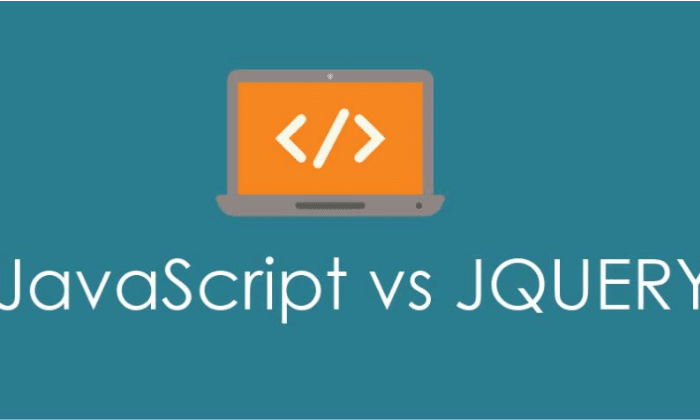
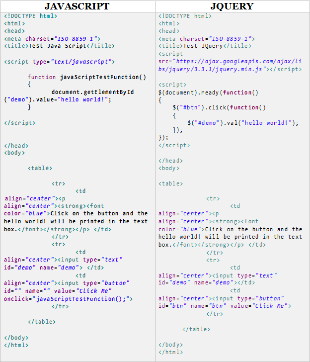

# What is a difference between jQuery and JavaScript?

&nbsp;

&nbsp;

&nbsp;

## JavaScript

JavaScript is a lightweight, interpreted programming language. It is designed for creating network-centric applications. It is complimentary to and integrated with Java. JavaScript is very easy to implement because it is integrated with HTML. It is open and cross-platform.
jQuery is automatically optimized to work with a lot of browsers. But, JavaScript is still dealing with some issues such as cross-browser compatibility. This can be due to poor JavaScript implementation practices by web browser developers.

&nbsp;

&nbsp;

## jQuery

&nbsp;

jQuery is a fast and concise JavaScript library created by John Resig in 2006. jQuery simplifies HTML document traversing, event handling, animating, and Ajax interactions for Rapid Web Development.

&nbsp;

## Key Differences Between JavaScript vs JQuery
- The first JavaScript engine was created by Brendan Eich for the Netscape Navigator web browser at Netscape. and its code name was Spider Monkey. The project was originally called Mocha, then renamed to Live Script and finally when Netspace and Sun did license agreement it was again renamed to JavaScript.
- With JQuery one has to write less line of code which is a big factor as it saves time and also easy to maintain codes with fewer lines.
- JQuery libraries are easily available as it is open-source.
- JQuery website has comprehensive documentation and tutorials to get help to understand and start programming even to beginners.

## and that's how to code in each language
