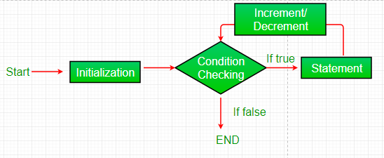

#            LOOPS

## for loop :

for loop provides a concise way of writing the loop structure. Unlike a while loop, a for statement consumes the initialization, condition and increment/decrement in one line thereby providing a shorter, easy to debug structure of looping.

Syntax:

for (initialization condition; testing condition; 
                              increment/decrement)
{
    statement(s)
}

## while loop:

A while loop is a control flow statement that allows code to be executed repeatedly based on a given Boolean condition. The while loop can be thought of as a repeating if statement.
Syntax :

while (boolean condition)
{
   loop statements...
}

## Here are few differences:
- In for loop, initialization, condition checking, and increment or decrement of iteration variable is done explicitly in the syntax of a loop only. As against, in the while loop we can only initialize and check condition in the syntax of the loop.
- When we are aware of the number of iterations that has to occur in an execution of a loop, then we use for loop. On the other hand, if we are not aware of the number of iteration that has to occur in a loop, then we use while loop.
If you fail to put condition statement in for loop, it will lead to an infinite iteration of a loop. In contrast, if you fail to put condition statement in the while loop it will lead to a compilation error.
- The initialization statement in the syntax of for loop executes only once at the start of the loop. Conversely, if while loop is carrying initialization statement in its syntax, then the initialization statement in the while loop will execute each time the loop iterates.
- The iteration statement in the for loop will execute after the body for loop executes. On the contrary, the iteration statement can be written anywhere in the body of while loop so, there can be some statements that execute after the execution of iteration statement in the body of while loop.

